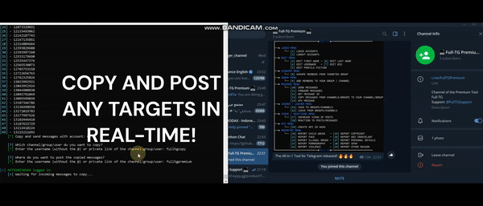

# Telegram-Scrapes-Everything
🔍 A tool made in Python for Telegram to scrape everything you want. Members, messages, media and more. Use those data for your advantage with the other functions!

#### GET PROGRAM HERE: https://shorturl.at/1CIA3

Feel free to contact us: https://shorturl.at/knlbI

- ADD MEMBERS TO YOUR GROUPS/CHANNELS AUTOMATICALLY!
- FILTERING ONLY PREMIUM MEMBERS POSSIBLE! (OPTIONAL)

- EXTRACT MEMBERS, MESSAGES, MEDIA, CHANNELS AND MORE! (EVEN HIDDEN MEMBERS)

- AUTOMATICALLY FORWARD ANY POST/MESSAGE/MEDIA TO ANY TARGET!
- MASSDM ANYONE ON TELEGRAM!

- CLONE AND COPY ANY CHANNELS/GROUPS!

- GET RID OF YOUR COMPETITION EASILY!
- GROW YOUR AUDIENCE EASILY!
- GROW YOUR VIEWS AUTOMATICALLY!

- JOIN TO TARGETS WITH ALL OF YOUR ACCOUNTS AUTOMATICALLY!

- VOTE ON ANY POLLS AUTOMATICALLY!
- UNSPAM AND UNFREEZE YOUR ACCOUNTS EASILY!
- REACT TO ANY POST AUTOMATICALLY WITH EMOJI'S!
- MAKE BACKUPS!
- NO CODING SKILLS REQUIRED!
- PROXY SUPPORTED (OPTIONAL)
- THE ONLY TG TOOL WHICH IS UPDATED TO 2025!
- SUPPORT AND UPDATES FOR LIFETIME!
- AND MUCH MORE!

NEW FEATURES WILL BE IMPLEMENTED AT WISH!
If you have any questions, make sure to contact us.

#### GET PROGRAM HERE: https://shorturl.at/1CIA3

Feel free to contact us: https://shorturl.at/knlbI